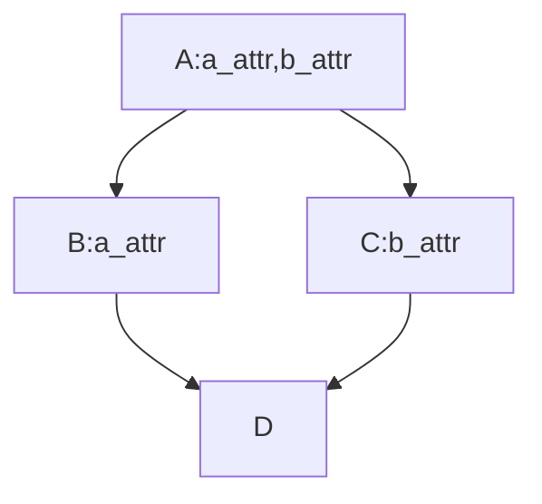

# 类对象的属性

就像模块一样，类对象、实例对象都是命名空间。

- 类对象的属性（包括类数据和方法），是通过class语句内的顶层赋值语句产生的。
- 实例对象的属性，是通过实例属性赋值语句 obj.attr = value 而产生的。包括：
  - `__init__()`和其他方法里面的 self.attr = value 语句（self就是调用方法的这个对象）
  - 不在方法体内、散落在其他地方的“硬编码”，比如  obj.attr = value 。不建议这么做。

### 类的数据属性（类数据）

- 类数据可以被类对象、所有实例对象共享访问。
- 类数据只可以被类对象赋值（更改数据）。用实例对象赋值，对类数据没有任何影响，但是这个变量名会成为这个实例的属性，于是b2.data属性表达式再也不能访问类属性了。

```Python
class B():
    data = 1
b1 = B()
b2 = B()
# 类对象、所有的实例对象都可以引用
print(B.data, b1.data, b2.data)  # 1 1 1
# 一旦对实例属性进行赋值，就成为实例属性，而覆盖了类数据。类属性不受影响
b1.data += 1  # 先引用取值，取到类数据，然后赋值就成了实例属性
print(B.data, b1.data, b2.data)  # 1 2 1
B.data = 'classData'
print(B.data, b1.data, b2.data)  # classData 2 classData
```

而且，因为类对象和实例对象是不同的命名空间，所以类属性和实例属性用同样的变量名不会产生任何冲突。

```python
class B():
    data = 1
    def __init__(self, value):
        self.data = value
b1 = B('b1')
b2 = B(2)
print(B.data, b1.data, b2.data)  # 1 b1 2
```

### 类的方法

Python的类是个语法糖。一个函数写在类里面和写在类外面没有区别，唯一的区别就是参数：实例方法的第一个参数是self，类方法的第一个参数是class，而静态方法不需要额外的参数。

##### 实例方法

方法替实例对象提供了要继承的行为。方法和函数没有什么区别，唯一的不同，实例方法必须接受方法调用的主体——实例对象。

```python
class B():
    def show(this, msg):  # 参数名是不是'self'无关紧要，用this都可以，位置才是关键
        this.msg = msg  # 左边是实例的属性，右边是参数名，是传入的对象。
        print(this, this.msg) # 对实例的属性引用、赋值一定要用实例名，免得和其他数据混淆。
# 以实例对象调用。Python用继承语法进行属性查找，并且自动传入调用的实例对象
b = B()
b.show('Hello')  # <__main__.B object at 0x1021a7be0> Hello
# 以类对象调用。手动从确定的类调用方法体，并且手动传入调用的实例
B.show(b, 'Make')  # <__main__.B object at 0x1021a7be0> Make
```

构造函数`__init__()`调用方式也不例外。

```python
class A():
    def __init__(self, arg1):
        self.a = arg1
    def __str__(self):
        attrs = [key + '=' + str(self.__dict__[key]) for key in self.__dict__]
        return '%s: %s' % (self.__class__.__name__, ', '.join(attrs))
class B(A):
    def __init__(self, arg2):
        A.__init__(self, arg2)
        # super().__init__(arg2)
        self.b = arg2
print(B('Bclass'))  # B: a=Bclass, b=Bclass 证明A类也正确初始化了
```

不过，在下面的钻石继承中，如果所有的类都用`Class.__init__()`将不能把所有的类都正确初始化。还有另外的方式，`super().__init__(arg...)`而且效果会更好，所有的类都能正确初始化。

```python
class A():
    def __init__(self, arg1):
        self.a = arg1
    def __str__(self):
        attrs = [key + '=' + str(self.__dict__[key]) for key in self.__dict__]
        return '%s: %s' % (self.__class__.__name__, ', '.join(attrs))
class B(A):
    def __init__(self, arg2):
        super().__init__(arg2)
        self.b = arg2
class C(A):
    def __init__(self, arg3):
        super().__init__(arg3)
        self.c = arg3
class D(B, C):
    def __init__(self, x):
        super().__init__(x)
        self.d = x
print(D(1))  # D: a=1, b=1, c=1, d=1 说明所有的类都已经正确初始化
```
##### 方法与绑定、无绑定

类的方法（普通实例方法，而不是类方法和静态方法），存在着绑定无绑定的问题。

方法本质是一种特殊的函数，就像函数那样，可以赋值、作为参数传递、组建数据结构等等。

方法的调用 instance.method()，其实内部分为两步: item = instance.method获取属性，也就是方法对象，然后item()执行这个方法。方法调用的两种方式“以类对象调用方法”、“以实例对象调用方法”，如果将属性获取和函数调用分离，就得到“无绑定”、“绑定”的概念。

套用普适性的属性获取语法 obj.attr ，方法有两种获取方式：以类对象获取 cls.attr 和 以实例对象获取inst.attr，前者得到无绑定方法（没有绑定实例对象的方法），或者得到绑定实例方法。

```python
class A: 
    def meth(self, msg):print('Hi', msg)
    def me(self): return self.meth
a = A()
A.meth(a, 'Jim')  # 以类对象调用方法，必须传入实例对象。
unbond_meth = A.meth  # 用类对象，得到无绑定方法。这只是获得一个函数的引用值。
unbond_meth(a, 'Jim')  # 无绑定方法，调用必须传入实例对象
a.meth('Jim')  # 以实例对象调用方法，无需传入实例对象
bound_meth = a.meth  # 用实例对象，获取到绑定方法。这是将实例对象和函数对象打包。
bound_meth = A().meth  # 更好的方式获取绑定方法
bound_meth = A().me()  # 其他方式，隐晦地获取。因为调用 def me(self)，得到了 self.meth
bound_meth('Jim')  # 绑定方法，调用时无需传入实例对象。
```

绑定方法对象，就是一个函数对象。可以像普通函数那样任意地使用。在Python3中，type()运算一个无绑定函数，结果是"function"，意思是：这就是一个函数！

可调用对象：def函数、lambda函数、带有`__call__`类的实例对象、绑定方法、类（class比较特殊，毕竟调用结果是产生一个实例）。它们都有自己的内省信息，都可以调用，都可以作为参数传递、都可以构建数据结构。


##### 类方法和静态方法

```python
class F():
    def instance_method(self):print("类的实例方法，只能被实例对象调用")
    @classmethod
    def class_method(cls):print("类方法，可以被类和实例调用")
    @staticmethod
    def static_method():print("静态方法，可以被类和实例调用")
f = F() # 以实例调用 实例方法、类方法、静态方法
f.instance_method()
f.class_method()
f.static_method()
F.class_method(); F.static_method() # 以类对象调用 类方法、静态方法
```

- **静态方法：**无法访问类属性、实例属性，相当于一个相对独立的方法，跟类其实没什么关系，换个角度来讲，其实就是放在一个类的作用域里的函数而已。
- **类成员方法：**可以访问类属性，无法访问实例属性。上述的变量val1，在类里是类变量，在实例中又是实例变量，所以容易混淆。


##### 静态方法的另一种写法：普通函数

方法的本质是特殊的函数。而静态方法，就是函数。这在Python3中，表现的最彻底。如果像普通函数那样写，并且用普通函数那样使用，也是可以的。但最好还是用@staticmethod，语义明显。

```python
class A:
    def func(msg1, msg2): print(msg1,msg2)
a = A()
a.func('a','b')  # TypeError: func() takes 2 positional arguments but 3 were given 用实例调用，像普通函数那样使用，就违法了。
a.func('a')  # <__main__.A object at 0x101978978> a  把msg1当做self，幸好接口支持
A.func('a', 'b')  # a b 用类对象调用，普通函数那样使用
```


### 方法重载：不建议

java里，用方法签名判断究竟调用哪个方法。方法签名 = 方法名 + 参数列表(参数数量、参数类型、顺序)

调用相同的方法名，由于参数列表的不同，就可以确定究竟调用哪个函数。这就是方法重载。

**参数类型：**Python的多态是基于对象的接口，而不是基于对象的类型。所以Python调用函数的时候，不判断参数对象的类型。

**参数数量：**参数的数量也不可以重载。比如下列的代码：

```python
class E:
    def meth(self, a):pass
    def meth(self, a, b):pass
```

在class语句块内，def只是创建一个个函数对象，然后赋值给函数名。经过两次赋值后， meth 这个变量名，只引用了一个函数对象，那就是后面定义的那个函数对象。

如果非得要重载（同样的方法名，实现不一样的逻辑操作），只能是判断参数长度或者参数类型，然后执行相应的处理逻辑（或者同时判断参数长度和参数类型）：

```python
class E:
    def meth(self, *args):  # 把所有的参数都接收进来。也可以用**args
        if len(args) == 1:  # 进行参数长度判断，实现参数数量的重载
            pass  # 在这里加上相应的处理逻辑
        elif isinstance(args[0], int): # 进行参数类型判断，实现参数类型的重载
            pass # 在这里也加上相应的处理逻辑
```

不过，通常都不这样做。因为这样违背了Python的多态模型：基于对象的接口而不是类型。针对接口而进行处理，就可以处理更多的类型，灵活适应更多场景。

最佳建议是：每种独特的操作都使用独特的方法名，不要依赖参数列表进行方法重载。

```python
class E:
    def meth_for_int(self, *args):pass # 处理int类
    def meth_for_tri(self):pass # 处理3个参数
```


### 类的伪私有属性

无论怎么命名，都不可能达到 java private一样真的私有，类外部还是能够访问和修改。

- 任何位置的单下划线变量名`_x`，不建议访问和修改
- 伪私有属性：类内的双下划线变量名`__x`（包括类数据、方法、实例属性），只是为了防止继承时发生变量名冲突和覆盖。

继承的时候，同一层级的类，变量名很容易相互覆盖。下例中，A类完全把B类的变量名覆盖了，B类的变量名无法被 obj对象访问。

```python
class A:
    cls_data = 'A_cls_data'
    def __init__(self): self.data = 'A'
    def meth(self): return 'A method'
class B:
    cls_data = 'B_cls_data'
    def __init__(self): self.data = 'B'
    def meth(self): return 'B method'
class C(A, B):pass
obj = C()
print(C.cls_data)  # A_cls_data
print(obj.cls_data, obj.data, obj.meth())  # A_cls_data A A method
```

而在下面的例子中，类数据、方法、实例属性前面都加了双下划线，同层级的类A与类B没有任何覆盖。但是，访问的时候变量名前面必须加上一个“下划线+类名”，比如用`obj._A__cls_data`访问`__cls_data`。这样做，依然可以访问和修改，就和普通变量没有什么区别，唯一的作用就是避免相互覆盖。

```python
class A:
    __cls_data = 'A_cls_data'
    def __init__(self):self.__data = 'A__self.data'
    def __meth(self): return 'A method'
class B:
    __cls_data = 'B_cls_data'
    def __init__(self):self.__data = 'B__self.data'
    def __meth(self): return 'B method'
class C(A, B):
    def __init__(self):
        A.__init__(self)
        B.__init__(self)
obj = C()
print(obj.__dict__)  # {'_B__data': 'B__self.data', '_A__data': 'A__self.data'}
print(C._A__cls_data, C._B__cls_data)  # A_cls_data B_cls_data 用类引用类数据
print(obj._A__cls_data,obj._B__cls_data)  # A_cls_data B_cls_data 用实例引用类数据
print(obj._A__data, obj._B__data,)  # A__self.data B__self.data 实例属性
print(obj._A__meth(), obj._B__meth())  # A method B method 方法
```


# 命名空间

解析变量名，有两种表达式

- 简单变量名解析：不用点号运算，这个和作用域有关。
- 属性解析：用属性运算符，这个和对象的命名空间有关。包括模块、类、类的实例。有些作用域会对对象的命名空间进行初始化（模块和类）。

简单变量名：

- 引用， var_name，根据LEGB原则查找
- 赋值，var_name = value，如果没有声明global或nonlocal，赋值就成为了本地变量。

属性名：

- 引用，obj.attr，如果是类对象和模块对象，直接在对象中读取，没有就引发Error。如果是类的实例对象，先读取自身的属性，如果没有就进行继承搜索，搜不到就Error。
- 赋值，obj.attr = value，在这个对象的命名空间内创建或者修改属性名。也就是，如果它有这个属性就更改，如果没有这个属性就创建这个属性。它并不会像属性引用那样进行属性搜索。

```python
X = 11  # 赋值，模块的全局变量
def f():
    print(X)  # 引用，搜索的结果是全局变量
def g():
    X = 22  # 赋值，函数的本地变量
    print(X)  # 引用，搜索结果是函数的本地变量
class A:
    X = 33  # 赋值，类数据
    def meth(self):
        X = 44  # 赋值，方法内的本地变量
        self.X = 55  # 赋值，实例对象的属性
if __name__ == '__main__':
    print(X)  # 11
    f()  # 11
    g()  # 22
    print(X)  # 11
    obj = A()
    print(obj.X)  # 33 没有赋值前，访问的是类数据
    obj.meth()
    print(obj.X)  # 55
    print(A.X)  # 33
```

#### 命名空间与字典

命名空间实际上是用字典实现的，属性运算的点号本质就是字典索引。模块、类、实例的命名空间都是这样。模块、类、实例，这些对象就是字典。

```python
class A:  # 这两个类故意设计成没有构造方法，运行一个方法后，实例对象才有属性
    def make_data(self):self.a = 'A'
class B(A):
    def make(self):self.b = 'B'
b = B()
print(b.__dict__, b.__class__)  # {}实例对象没有属性，所以属性dict为空。 <class '__main__.B'>实例连接到自己的类
print(B.__mro__) # (<class '__main__.B'>, <class '__main__.A'>, <class 'object'>) 类对象有MRO列表。用实例访问MRO：b.__class__.__mro__
print(B.__bases__, A.__bases__)  # (<class '__main__.A'>,) (<class 'object'>,)类对象连接自己的父类
print(B.__dict__.keys(), A.__dict__.keys())  # dict_keys(['__module__', '__doc__', 'make']) dict_keys(['__module__', '__dict__', 'make_data', '__weakref__', '__doc__'])访问每个类对象的命名空间
b.make_data();print(b.__dict__)  # {'a': 'A'}  # 运行一个方法，产生一个属性。
b.make();print(b.__dict__)  # {'a': 'A', 'b': 'B'}
b_another = B();print(b_another.__dict__)  # {} 这个实例没有运行任何一个方法，命名空间和字典就为空
```

对象的属性运算：

- 读取对象的属性，那`obj.attr`和`obj.__dict__['attr']`是完全等效的（模块对象、类对象、实例对象都是这样）。
- 然而，实例对象`instance_obj.attr`会执行继承搜索，就无法使用简单的`obj.__dict__['attr']`了。

实例的继承搜索步骤：

- 首先像普通的`obj.attr`那样，是用`obj.__dict__['attr']`读取自身的属性。
- 如果自身没有这些属性（比如类数据、方法），就执行继承搜索，用从类中获取；如果父类没有，就必须执行更深层次的继承搜索，到更高层级的父类中查找。这两步，实际上是MRO列表中轮询，然后读取每个类对象的属性：`for cls in b.__class__.__mro__: cls.__dict__['attr']`。新式类和经典类的MRO顺序是不同的。

#### dir()函数

dir()很像是`obj.__dict__keys()`，但是又比它更为强大，会搜索所有继承得来的属性。

```python
class A:
    def make_data(self):self.a = 'A'
class B(A):
    def make(self):self.b = 'B'
print(dir(A))  # ['__class__', '__delattr__', '__dict__',...'make_data'] 类A的结果里，包含了自己和类object的属性
print(dir(B))  # ['__class__', ...'__weakref__', 'make', 'make_data'] 类B的结果，则是自己、类A、类object
b = B()
print(dir(b))  # ['__class__', ...'__weakref__', 'make', 'make_data'] 实例对象，则是自己、父类、超类
b.make();print(dir(b))  # ['__class__', ...'__weakref__', 'b', 'make', 'make_data']
```

#### 命名空间链接

既然各个对象的命名空间是字典，它们之间就可以用各种方式链接起来。

- 模块和类对象的链接

  ```python
  import emp, sys  # emp 模块里面有 Chief类
  print(emp.__dict__.keys())  # 类对象是模块对象的一个属性。module.class就可访问
  # dict_keys(['__loader__', '__file__', '__builtins__', 'Chef', '__cached__', '__package__', '__spec__', 'PizzaMaker', 'Employee', '__doc__', 'Servant', '__name__'])
  print(emp.Chef.__dict__)  # 类对象的属性，记录了自己所属的模块。
  # {'__module__': 'emp', 'work': <function Chef.work at 0x008082B8>, '__init__': <function Chef.__init__ at 0x00808270>, '__doc__': None}
  print(sys.modules[emp.Chef.__module__])  # 用sys.modules得到所有模块字典。emp.Chef.__module__返回模块名。二者结合得到模块对象<module 'emp' from 'D:\\GitbackUp\\PyProject\\emp.py'>
  ```

- 实例对象与类对象的链接

  实例对象、类对象、父类对象的命名空间，是联通的。它们能够用特殊的方式沿着继承树向上访问（似乎不能向下访问）。

  ```python
  class A: pass
  class B(A): pass
  class C(A): pass
  class D(B, C): pass
  d = D()
  print(d.__class__,)  # <class '__main__.D'>得到所属的类对象。d.__module__得到模块对象
  print(D.__base__, D.__bases__) # <class '__main__.B'> 和(<class '__main__.B'>, <class '__main__.C'>)前者得到第一个父类B，后者得到所有的父类B和C（多继承）。
  print(D.__mro__)  # (<class '__main__.D'>, <class '__main__.B'>, <class '__main__.C'>, <class '__main__.A'>, <class 'object'>)继承顺序列表
  ```

  利用`__class__`和`__bases__`，我们可以编写一个攀爬继承树的工具：

  ```python
  def classtree(cls, indent): # cls是类对象，indent指明每层级的缩进
      print('.' * indent + cls.__name__)
      for supercls in cls.__bases__:
          classtree(supercls, indent + 3)  # 递归函数
  def instancetree(inst):
      print('tree of %s' % inst)
      classtree(inst.__class__, 3)
  if __name__ == '__main__':
      class A: pass
      class B(A): pass
      class C(A): pass
      class D(B, C): pass
      class E: pass
      class F(D, E):pass
      instancetree(B())
      instancetree(F())
  ```

  类树：

  ```mermaid
  graph RL;
  	object--> A
  	object-->E
  	A-->B
  	A-->C
  	B-->D
  	C-->D
  	D-->F
  	E-->F
  ```

  运行结果：缩进代表在类树的高度

  ```HTML
  tree of <__main__.B object at 0x0095E610>
  ...B
  ......A
  .........object
  tree of <__main__.F object at 0x0095E610>
  ...F
  ......D
  .........B
  ............A
  ...............object
  .........C
  ............A
  ...............object
  ......E
  .........object
  ```

  1


# 子类如何继承父类的方法

通过继承树的属性搜索，就形成了类的层次结构，低层级的类属性会覆盖高层级的类属性。那么，继承的时候，子类可以怎么处理父类的方法呢？

- 直接继承，毫无改动。
- 直接覆盖，完全推翻父类的逻辑。
- 通过回调，在父类的基础上进行扩展。
- 抽象接口的实现：父类画饼，子类干活。

##### 继承、覆盖、回调扩展

```python
class Father():
    def meth(self):
        print('Father method')
class Inheritor(Father): # 直接继承
    pass  # 直接继承，就是不用写这个方法
class Replacer(Father):  # 覆盖
    def meth(self):  # 完全和父类不相干
        print('Replacer method')
class Extender(Father): # 扩展
    def meth(self):
        Father.meth(self)  # 回调父类的方法，用super().meth()也可以
        print('Extender method')
for i in (Father(), Inheritor(), Replacer(), Extender()):
    i.meth()
```

##### 抽象接口

抽象接口比较复杂，单独讲解。

```python
class Father():
    def delegate(self):  # 这个方法只是个空壳，主体是内部的action()
        self.action()
class Provider(Father):
    def action(self):  # 如果子类不实现action()方法，就会引发AttributeError
        print('Provider action()')
p = Provider()
p.delegate()
```

表达式 p.delegate() ：属性查找，找到父类Father的delegate()方法，并且执行。执行的过程中遇到表达式  self.action() 又开始属性查找，是在自己的类中找到 action()方法，然后执行。

父类设置了一个空，需要子类填空。方法内部的逻辑，需要子类实现，这种方法叫做抽象方法。而带有抽象方法的类，叫做抽象类。

上面的抽象类和抽象方法的写法很少见。一般会如下：

```python
class Father():
    def delegate(self):  # 这个方法只是个空壳，主体是内部的action()
        self.action()
    def action(self):
        raise NotImplementedError('must defined action()')
class ProviderA(Father):pass # 没有实现抽象接口
class ProviderB(Father):  # 实现了抽象接口
    def action(self):
        print('Provider action()')
Father().delegate()  # Father的实例对象，调用会引发Error
ProviderA().delegate()  # ProviderA的实例对象，调用会引发Error
ProviderB().delegate()  # Provider的实例对象，正常调用
```

实际上，这种方式依然不常用。正确的写法是这样：

```python
from abc import ABCMeta, abstractclassmethod
class Father(metaclass=ABCMeta):  # python3的写法
    def delegate(self):  # 这个方法只是个空壳，主体是内部的action()
        self.action()
    @abstractclassmethod
    def action(self):pass
class ProviderA(Father):pass # 没有实现抽象接口
class ProviderB(Father):  # 实现了抽象接口
    def action(self):
        print('Provider action()')
f = Father()  # TypeError: Can't instantiate abstract class Father with abstract methods action
pa = ProviderA()  # TypeError: Can't instantiate abstract class...
ProviderB().delegate()  # Provider的实例对象，正常调用

# Python2的写法：不在class首行的括号里写，而在下一行写__metaclass__=ABCMeta。其他相同
class Father():
    __metaclass__ = ABCMeta
    ...
    @abstractclassmethod
    def action(self):pass
```

这种写法，任何一个含有抽象方法的类（包括抽象类、没有实现抽象方法的子类），都不能实例化对象。

Python的类就是个语法糖。一个函数写在类里面和写在类外面没有区别，唯一的区别就是参数，所谓实例方法就是第一个参数是self，所谓类方法就是第一个参数是class，而静态方法不需要额外的参数，所以必须区分。


## 经典类与新式类

- 在Python2中，只有继承自object的类才是新式类。包括主动继承（自己继承）和被动继承（父类继承自object）。现在Python2中，经典类和新式类都还能正常使用。
  ```python
  ### Python 2
  class A: pass  # 经典类
  class A(): pass  # 经典类
  class A(object): pass  # 只有明确继承自object才是新式类。
  ```

- 在Python3中，只有新式类，没有经典类。


新式类在语法和操作上几乎完全向后兼容经典类，只是为了添加一些高级特性。

##### 类型模式的变化

- 经典类：通过type()运算可知，类是类、实例是实例，二者的联系仅在于`obj.__class__ `
- 新式类和内置类型（str、list等等）：通过type()运算可知，类是类，实例是某个类的实例对象。
  ```python
  # 经典类
  class B:pass
  b = B()
  dir(b)  # ['__doc__', '__module__']
  dir(B)  # 与dir(b)相同
  type(b)  # <type 'instance'>
  type(B)  # <type 'classobj'>
  print b.__class__  # <class __main__.B at 0x020F4AB0>
  # 新式类
  class E(object):pass
  e = E()
  dir(e) # ['__class__', '__delattr__', '__dict__', '__doc__', ...]
  dir(E) # 与dir(e) 相同
  type(e)  # <class '__main__.E'>
  type(E)  # <type 'type'>
  # 内置类型
  a = str('H')
  type(str) # <type 'type'>
  type(a) # <type 'str'>
  dir(str) # ['__add__', '__class__',... 'upper', 'zfill']
  dir(a)  # 与dir(str)相同
  ```

内置类型，和自定义的类（经典类）不同，就会造成很多问题。比如，用一个对象，得到一个同类型的对象（找到它的父母造一个姐妹出来）。并且在经典类中，`type(obj1)==type(obj2)`类型测试是无效的，它们永远相等。所以应该使用`obj1.__class__==obj2.__class__`或使用最好的`isinstance(obj, Aclass)`

```python
# 内置类型
class_of_obj = type(obj)  # 得到它的类对象
new_obj = class_of_obj()  # 调用类的构造函数，得到新的类的实例
type(obj1)==type(obj2) # 与 obj1.__class__==obj2.__class__结果相同。
# 经典类
class_of_obj = obj.__class__  # 得到它的类对象
new_obj = class_of_obj()  # 调用类的构造函数，得到新的类的实例
type(obj1)==type(obj2) # 永远为True。而 obj1.__class__==obj2.__class__才有实际效果
```

使用新式类，很多方面和内置类型一样，这些问题一扫而空：

- 所有的类，都是object的子类。

- 所有的类，调用的结果都是启动构造函数返回一个实例。

- 所有的类，type(Aclass)都返回type 'type'，它的实例对象obj进行type(obj)运算返回所属的类。

- 所有的类，都由元类产生。元类，是type类，或者经过定制的子类。但object和type是先有鸡还是先有蛋的问题。
  ```python
  isinstance(type, object) # True 因为type的基类是object。所有的类都继承自object，连type类都是。
  isinstance(object, type) # True  因为object的类型是type。type是生成各种类的元类。
  type is object # False 因为object和type又不是同一个对象。
  ```


##### 继承搜索顺序的变化（Method Resolution Order，MRO）


这个功能，主要影响多继承的钻石模式（Diamond Pattern）下的属性查找，经典类和新式类在这点上并不兼容。如上图，如果超类A下面有两个类BC，各覆写了一个方法，那么，表达式` d.b_attr`的意思是用D的实例对象查找属性b_attr

- 经典类中，搜索顺序以绝对深度优先，D>B>A>C，所以先找到A的b_attr，然后就停止了，结果是C类的属性没有成功覆写A类的属性。当然这类问题也可以解决，

  ```python
  class D:b_attr = C.attr
  d = D()
  d.b_attr # 无论是类数据，还是方法，都能成功获取继承树上的正确版本
  # 如果是方法，还有一个解决方式
  class D:
      def b_attr(self):
          C.b_attr(self)  # 回调。指定调用哪个类下的方法
  ```

- 新式类中，搜索顺序以宽度优先，D>B>C>A，所以先找到C的b_attr，然后就停止了，结果是C类的属性成功覆写A类的属性。并且，因为所有的类都继承自object类，所以新式类本质上都是钻石继承，而这种搜索顺序可以避免多次访问相同的类所以性能更好，而且object类提供了很多默认操作，这种搜索顺序也使得object的默认操作不会覆盖更低级的子类。


其他的新式类的变化：

##### super added
##### descriptors added
##### new style class objects cannot be raised unless derived from `Exception` 
##### `__slots__`added


## 多重继承的例子

继承这个类 ListInstance ，就能打印实例的具体信息：类名、内存地址、所有的实例属性

```python
class ListInstance:
    def __str__(self):
        return '<instance of %s, address %s, attribute:\n\t%s>' % (
        self.__class__.__name__, hex(id(self)), self.__attrnames())  # 类名、内存地址、所有的属性
    def __attrnames(self):  # 每个属性名和值对应，然后连成一个str
        return ', '.join(['%s=%s' % (attr, self.__dict__[attr]) for attr in sorted(self.__dict__)])
if __name__ == '__main__':
    class A(ListInstance):
        def __init__(self): self.data, self.age= 'A', 13
    print(A())
```

但是，这还是不够的。对于类的实例对象，`obj.attr`不仅仅是读取自己的属性，还会执行属性继承搜索。改动一下，成为

```python
class ListInherited():
    def __str__(self):
        return '<instance of %s, address %s, attribute:\n\t%s>' % (self.__class__.__name__, hex(id(self)), self.__attrnames())
    def __attrnames(self):
        result_list = [('\tname %s=<> \n' % attr if attr[:2] == '__' and attr[-2:] == '__'
                        else '\tname %s=%s \n' % (attr, getattr(self, attr)))
                       for attr in dir(self)]
        result = ''
        for attr in dir(self):
            if attr[:2] == '__' and attr[-2:] == '__':
                result += '\tname %s=<> \n' % attr
            else:
                result += '\tname %s=%s \n' % (attr, getattr(self,attr))
        return ''.join(result_list)
if __name__ == '__main__':
    class A(ListInherited):
        def __init__(self): self.data, self.age = 'A', 13
    print(A())
```


# 运算符重载（操作符重载）

运算符重载，就是当实例对象出现内置操作时，用类的方法拦截这些操作，然后获得相应的结果。

- 运算符重载不是必须的，也不是默认的，而是为了让类的实例对象模拟内置对象的接口，表现的像内置类型。
- 几乎所有的运算符，都有重载方法，有些甚至有好几个（例如加法就有`__add__`、`__radd__`、`__iadd__`）。运算符重载可以拦截：所有的Python常规运算符、打印、函数调用、属性点号运算。
- 运算符重载，是通过在类里面定义特殊名称的方法来实现的，这些方法前后都有双下线。Python定义了内置的操作表达式/运算 与 特殊方法名之间的映射关系。
- 运算符重载也可以继承。


| 方法名                  | 重载意义      | 内置操作符（调用方式）                      |
| :------------------- | :-------- | :------------------------------- |
| `__init__`           | 构造函数      | 对象创建: X = Class(args)            |
| `__new__`            | 创建        | 在`__init__`之前创建对象                |
| `__del__`            | 析构函数      | X对象收回                            |
| `__repr__`和`__str__` | 打印，转换     | print(X)，repr(X)，str(X)          |
| `__call__`           | 调用        | X(*args, **kwargs)               |
| `__getattr__`        | 点号运算      | X.undefined                      |
| `__setattr__`        | 属性赋值语句    | X.any=value                      |
| `__delattr__`        | 属性删除      | del X.any                        |
| `__getattribute__`   | 属性获取      | X.any                            |
| `__get__`  `__set__` | 描述符属性     | X.attr, X.attr=value, del X.attr |
| `__bool__`           | 布尔测试      | bool(X)                          |
| `__add__`            | 运算符+      | 如果没有_iadd_， X+Y， X+=Y            |
| `__or__`             | 运算符\|     |                                  |
| `__getitem__`        | 索引运算      | X[key]，X[i:j]                    |
| `__setitem__`        | 索引赋值语句    | X[key]，X[i:j]=sequence           |
| `__delitem__`        | 索引和分片删除   | del X[key]，del X[i:j]            |
| `__len__`            | 长度        | len(X)，如果没有`__bool__`，真值测试       |
| `__radd__`           | 右侧加法      | other+X                          |
| `__iadd__`           | 实地（增强的）加法 | X+=Y(or else` __add__`)          |
| `__contains__`       | 成员关系测试    | item in X(任何可迭代)                 |
| `__index__`          | 整数值       | hex(X), bin(X),  oct(X)          |
| `__delete__`         | 描述符属性     | X.attr, X.attr=value, del X.attr |

接下来举例说明常见的运算符重载

#### 构造函数`__init__`


