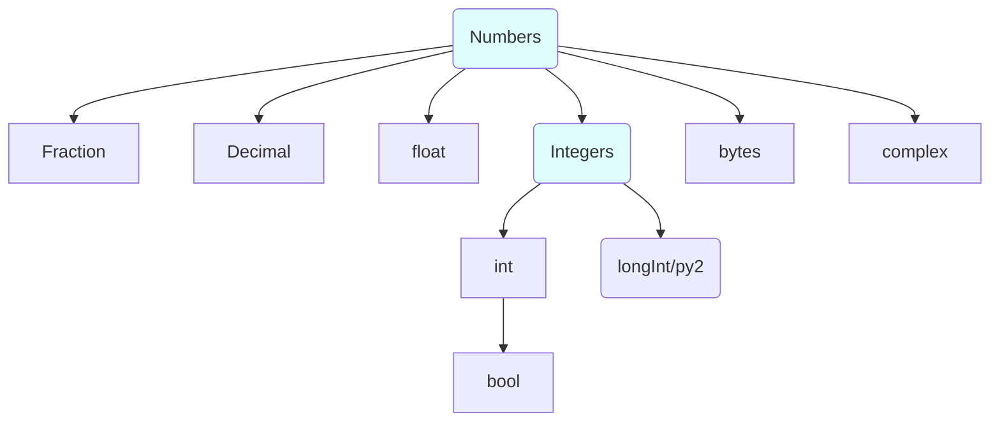
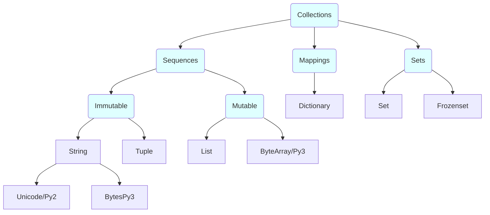
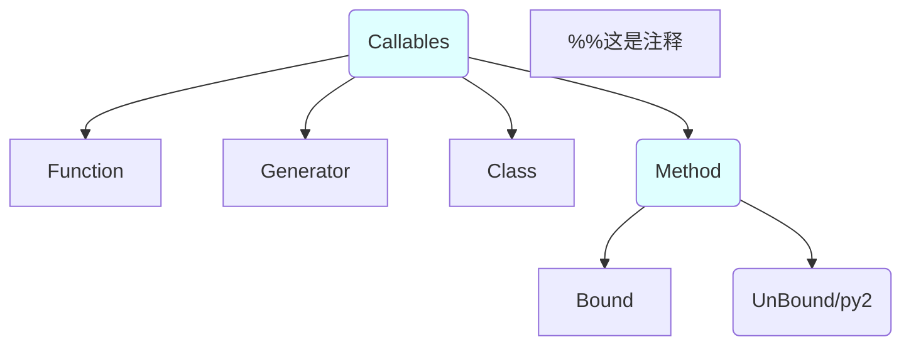
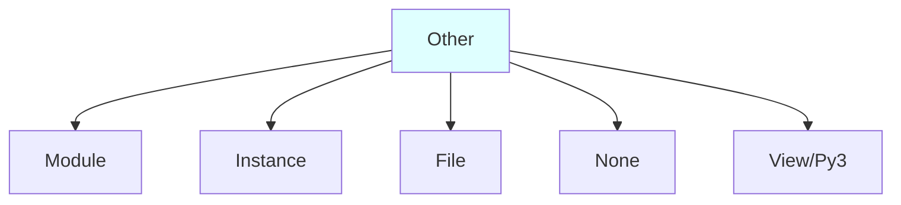
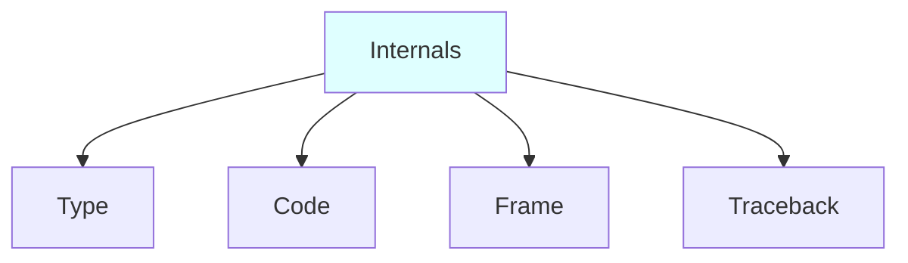
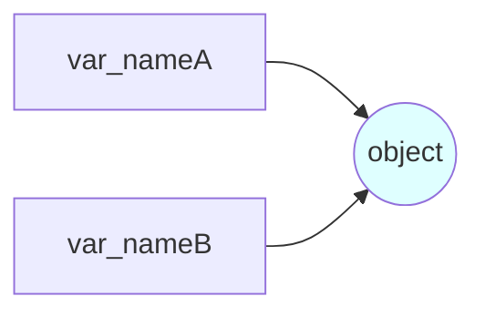

Excel读取模块 ：xlwt

编程，是用一些步骤（操作方式），去处理一些事情（操作的对象）。
程序处理的数据，以对象的形式出现。对象，是内存中的一部分，包含数值和相关的各种操作。
Python 程序由模块构成，模块包含语句，语句包含表达式，表达式建立并且处理对象——所以，对象是Python中最基本的概念。在Python程序中处理的每种东西，都是一种对象。
C／C++／Java，编程中很多工作都是作数据结构：定义数据类型，内存分配，对象搜索和存取等。而Python的内置数据类型非常强大。
为什么要优先使用内置数据类型？（而不是自己构建数据类型）
1. 写起来容易，效率高
2. 即使要构建自己的数据类型（比如写个class），在内置类型的基础上构建也会更简单

Python可以在旧版本中开启新版本的特性，只需： `from __future__ import name`


## 类型入门
Python 没有类型声明，表达式的语法就决定了创建和使用的对象的类型。每个数据类型，都和某些操作一一对应。
核心数据类型（对象的类型）：数字（包括集合）／字符串／元组／列表／字典／None／Boolean／函数／类／模块／文件








**六个标准数据类型：**
- Number（数字）、String（字符串）、List（列表）、Tuple（元组）、Sets（集合）、Dictionary（字典）
- 可变数据类型：列表list[ ]、字典dict{ }
- 不可变数据类型：整型int、字符串str''、元组tuple（）

**如何查看一个类型的帮助文档？**
- ```python
  s =‘astring’
  dir(s)  # 列出所有的字符串的方法名
  help(s.upper)  # 列出字符串特定属性upper的使用帮助
  help(s)   # 列出所有字符串类型的帮助文档——不建议使用这种方式
```

**查看一个对象的类型**
在Python中，一切都是对象。每个基本的数据类型，都是一个预置的类。
而运算符，是类的方法，与普通的 X.method()没有什么不同，但是它又是特殊的方法。比如list的`__add__()`方法，定义了`+`这个符号对于列表实例对象的意义。类似地，自定义类的时候，也可以用运算符重载的技术做到这点。
- type(x)返回变量x指向对象的类型
```python
>>> type("")
<class 'str'>
```
- Python中，任何东西都是对象类型，类型本身也是对象类型：
```python
>>> type(list)
<class 'type'>
>>> type(type)
<class 'type'>
```
- isinstance(x, aClass)用于测试x所指对象是否为 aClass类的一个实例。这适用于内置数据类型（比如str），和自定义的class。
```python
>>> isinstance([], list)
True
```
- issubclass(aClass, bClass)则可以判断 aClass是否为 bClass的子类。
```python
>>> issubclass(map, dict)
False
```
- 调用一个类型的名字，是调用它的构造函数，而不仅仅是类型转换
```python
>>> str(True)
'True' # 布尔值转为str
```
- 有3种方式检查数据类型，并且进行限制：
```python
s = "string"
if type(s) == type(list): # if type(s) is list:也可以
    print("%s is a list" % s)
if type(s) == type([]):
    print("%s is a list" % s)
if isinstance(s, list):  # 最好的方式
    print("%s is a list" % s)
```
但是，一般来说，在代码中进行类型检查是错误的，破坏了代码的灵活性，限制了代码的类型。Python代码不关心特定的数据类型，只关心接口，这就是Python的多态设计。
动态类型，不进行类型约束，这是Python多态的基础。Python的多态是属性总是在运行期解析，一个操作的意义取决于被操作对象的类型（比如x.attr表达式的意义取决于x的类型）。同样的操作对不同的对象来说意义可能不同，前提是该对象支持该操作；若对象不支持某种操作，则Python会在运行时检测到错误并自动抛出一个异常。

##动态类型
Python 是动态类型语言。也是强类型语言，特定的对象有特定的接口，只能执行特定的操作。
动态类型和多态，是Python语言简洁和灵活的根源。
Python 只有一种赋值模型，所以理解了动态类型，就随处可用了。
**初始化赋值：变量、对象、引用**
初始化赋值语句`a = 3`
- **对象：**等式右边，常量 3 创建了一个新的对象（一块内存空间）去表示这个值。
  ○ 每次运行一个表达式（运算或者常量赋值）生成一个新的值，Python都创建一个新的对象（内存空间）去表示这个值。标识一个对象唯一身份的是：对象的`id`，对象类型和值。
  ○ Python对象缓存了不变的对象并对其进行复用，如小整数和小字符串。但是逻辑上看，每个表达式的结果值都是不同的对象，占用不同的内存。
  ○ 每个对象都有2个标准的头部信息：数据类型标识符、引用计数器。Python 作为动态语言，对象的类型和引用计数都是在运行时确定。
  ○ 类型标志符：标识了该对象的类型。查看对象的类型用type()函数
  ○ 引用计数器：记录当前指向该对象的引用的数目，决定是否可以回收这个对象 。一旦它为0， 则该对象的内存空间就会自动回收。sys模块的getrefcount函数会返回对象的引用次数。
- **变量：**等式左边，创建一个变量名 a
  ○ 变量是一个系统表对象，拥有指向对象内存空间的连接（引用）。在Python内部，变量实际上是指向对象内存空间的一个指针
  ○ 变量在初始化赋值（第一次赋值）时创建。
  ○ 变量是通用的（一个变量可以引用任何对象），只是在某个特定的时间点引用了一个特定的对象。变量没有类型，不需要声明变量的类型。类型由对象决定，并且自动跟踪变量引用的对象的类型。
  ○ 当变量使用时（比如出现在表达式中），它会马上被当前引用的对象所代替，这时候解释器自动探测出对象的类型。比如  c = a ，将 a 引用的   对象 3  再次引用给 c 。未初始化赋值、创建的变量不准使用。
  ○ 给一个变量赋新值，并不是替换原始的对象，而是让这个变量去引用完全不同的一个对象。所以，仅仅会影响变量，不会影响对象。在有些语言中，变量是可改变的内存区域的地址，重新赋值会替换这个内存区域的值。而在Python中，变量是一个指向内存区域的指针，重新赋值，是让这个变量去引用一个新的对象（指向新的内存空间）。

**引用：**赋值语句的等式，创建一个变量 a 与对象 3 的引用。变量和对象存储在内存的不同区域，并通过引用相连。Python 中管理内存资源申请释放是通过**引用计数**来实现。
1. 增加引用计数：
   - 对象被创建：`x = 5`
   - 对象的别名被创建：`y = x`
   - 对象作为参数传递给函数：`foo(x)`
   - 对象成为容器对象的一个元素：`myList = [123, x, 'xyz']`
2. 减少引用计数：
   - 一个本地引用离开其作用范围：函数调用结束
   - 对象的别名被显式销毁：`del y`
   - 对象的一个别名被赋值给其他对象：`x = 123`
   - 对象被从一个窗口对象中移除：`myList.remove(x)`
   - 窗口对象本身被销毁：`del myList`

* 对象的`id`可以类比为 C 语言中的指针。引用就是从变量到对象的内存指针，相当于 C 语言的 void 指针。
* 查询一个对象被引用的次数：数字对象 1 被引用了 607 次。还可以查询对象的`id`
```python
>>> import sys
>>> sys.getrefcount(1)
607
>>> a = 1
>>> id(a)
4297546560
```

**共享引用**
多个变量名引用同一个对象时，称为共享引用
- ```python
  a = 3    # 初始化赋值，创建对象 3、变量 a 、以及相互之间的引用。
  b = a    # 变量a马上被替换成对象 3，所以b也引用了对象 3——a与b共同引用一块内存区域
  a = a + 2   # 变量a 替换成对象 3 ，与对象 2 进行运算得到全新的对象 5，然后创建变量a 与对象 5的引用。此语句对 变量 b 没有任何影响。
  a = "something"  # 变量a 引用新的对象 "something"
```

- **判断是否共享引用（同一个还是相等）**
==操作符比较的是两个变量引用的对象是否具有相同的值
is操作符比较的是两个变量是否引用的是同一个对象。共享引用的多个变量之间，is比较的结果为True。
```python
L = [1, 2, 3]
M = [1, 2, 3]
print L == M  # True ，因为 == 操作符比较两个对象的数值，数值的确相等。
print L is M  # False ，因为 is 操作符比较L与M是不是引用同一个对象（指向同一块内存）
```
但是，有时候又会出现“意外情况”：
```python
L = 42
M = 42
print L == M  # True ，因为 == 操作符比较两个对象的数值，数值的确相等。
print L is M  # True ，很奇怪。
```
因为Python把小的整数缓存，并且复用了，所以L与M的确引用了同一个对象。这是Python决定的，不是代码能够改变的。
- **共享引用的原地修改**
  在共享引用中，对象的原地修改操作会影响到所有的引用该对象的变量。有些数据类型的对象，本身就是对其他对象的引用，所以是可变的，可以原地修改。比如列表、字典、class

```python
L1 = [1, 2, 3, 4]
L2 = L1  # 共享引用。L2 也引用了list 对象 [1, 2, 3, 4]
L1 = 89  # L1 引用了全新的对象 89。不影响 L2
```
但是，下面就会相互影响了
```python
L1 = [1, 2, 3, 4]
L2 = L1  # L1与L2共享引用
L1[0] = 32  # 结果L2 也受到了影响，变为 [32, 2, 3, 4]
```
可变的对象，比如 list，使用多重目标赋值、增强赋值语句，要小心，原处修改会影响其他变量。
    ```python
    a = b = [1, 2, 3]
    c = ['c']
    c += a  # ['c', 1, 2, 3]
    print(a, b, c)  # [1, 2, 3] [1, 2, 3] ['c', 1, 2, 3]
    a += a
    print(a, b)  # 都为 [1, 2, 3, 1, 2, 3]
    ```
- 而且，原处修改对象的函数没有返回值
    ```python
    L = [1,2,3,4]
    L.append(8)  # 返回None，也就是没有返回值。
    L = L.append(8)  # 他本来想得到修改后的列表，然而却只能得到 L = None
    for k in D.keys().sort():  # 这写法也是错误的。因为 D.keys().sort()返回None
    # 正确写法：
    ks = list(D.keys()); ks.sort()
    for k in ks:
    ```
- 避免共享对象带来的影响，可以直接拷贝对象。让不同的变量，引用不同的对象（指向不同的内存区域）
```python
L2 = L1[:]  # 列表拷贝最简单的办法——从头到尾切片。
其他的对象，应该使用copy方法
import copy
x = copy.copy(y)  # make a shallow copy of y 创建对象 y 的影子拷贝
x = copy.deepcopy(y)  # make a deep copy of y 创建对象 y 的深度拷贝
```
影子拷贝和深度拷贝，差异就在复合对象上（包含其他对象的对象，比如列表和实例）。
影子拷贝是创建一个复合对象，然后内含的对象，还是上一个对象的引用。
深度拷贝，创建一个复合对象，内含的对象，也是新建的。

# 浅拷贝与深拷贝

**浅拷贝：**前面我们已经理解了，标识一个对象唯一身份的是对象的`id`，对象类型和值，那么什么是浅拷贝呢？浅拷贝就是创建一个相同类型和值但不同`id`的新对象，其中对象中的值是来自原对象的引用，所以浅拷贝产生的新对象中可变对象的值发生改变时**原对象的值也会随之改变**。

**工厂函数、切片操作、copy 模块中的 copy 操作**都是浅拷贝，浅拷贝典型的使用场景就是对象自身发生改变的同时需要保持对象中的值完全相同，如 List 排序：

```python
In [1]: import copy

In [2]: def sorted_list(olist, key=None):
   ...:     copied_list = copy.copy(olist)
   ...:     copied_list.sort(key=key)
   ...:     return copied_list
   ...: 

In [3]: a = [3, 5, 2, 6, 1]

In [4]: b = sorted_list(a)

In [5]: b
Out[5]: [1, 2, 3, 5, 6]

In [6]: id(b) == id(a)
Out[6]: False
```

**深拷贝：**理解了浅拷贝，深拷贝就变得简单了。深拷贝就是完完全全地拷贝了一个对象，该对象的值不再是引用自原对象，而是新开辟的地址，所以我们对深拷贝创建的对象可以随意操作而不必担心原对象的改变。深拷贝需要依赖 copy 模块的 deepcopy 操作：

```python
In [1]: a = [1, 2]

In [2]: b = [a, a]

In [3]: b
Out[3]: [[1, 2], [1, 2]]

In [4]: from copy import deepcopy

In [5]: c = deepcopy(b)

In [6]: c[0].append(3)

In [7]: c
Out[7]: [[1, 2, 3], [1, 2, 3]]

In [8]: b
Out[8]: [[1, 2], [1, 2]]

In [9]: id(b[0]) == id(c[0])
Out[9]: False

In [10]: id(c[0]) == id(c[1])
Out[10]: True
```

同时，我们在定义类时可以定义`__copy__`和`__deepcopy__`来定制 copy 的行为：

```python
In [1]: class CopyObj(object):
   ...:     def __repr__(self):
   ...:         return 'Hello'
   ...:     def __copy__(self):
   ...:         return 'World'
   ...:     

In [2]: obj = CopyObj()

In [3]: print(obj)
Hello

In [4]: import copy

In [5]: copyobj = copy.copy(obj)

In [6]: print(copyobj)
World
```

# 数据类型转换

| 函数         | 描述               |
| ---------- | ---------------- |
| `int(x)`   | 将 x 转换为整数        |
| `float(x)` | 将 x 转换为浮点数       |
| `str(x)`   | 将 x 转换为字符串       |
| `hex(x)`   | 将整数 x 转换为十六进制字符串 |
| `oct(x)`   | 将整数 x 转换为八进制字符串  |
| `bin(x)`   | 将整数 x 转换为二进制字符串  |
| `chr(x)`   | 将整数 x 转换为字符      |
| `ord(x)`   | 将字符 x 转换为整数      |

同时，`list()`、`tuple()`、`dict()`和`set()`可以进行列表、元组、字典和集合转换。

# 自定义数据类型

Python 允许通过继承去自定义数据类型，很多第三方库或框架有类似的应用，这里简单实现了一个：

```python
class CustomDict(dict):
    '''Simple dict but support access as x.y style.'''

    def __init__(self, names=(), values=(), **kw):
        super(CustomDict, self).__init__(**kw)
        for k, v in zip(names, values):
            self[k] = v

    def __getattr__(self, key):
        try:
            return self[key]
        except KeyError:
            raise AttributeError(
                r"'CustomDict' object has no attribute '%s'" % key)

    def __setattr__(self, key, value):
        self[key] = value
```


