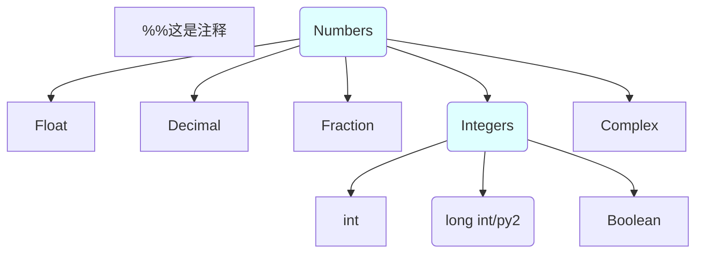
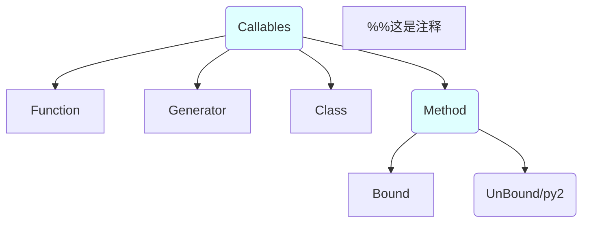
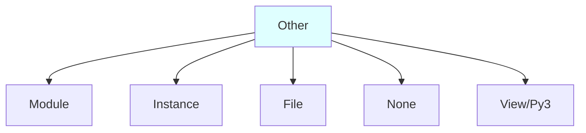
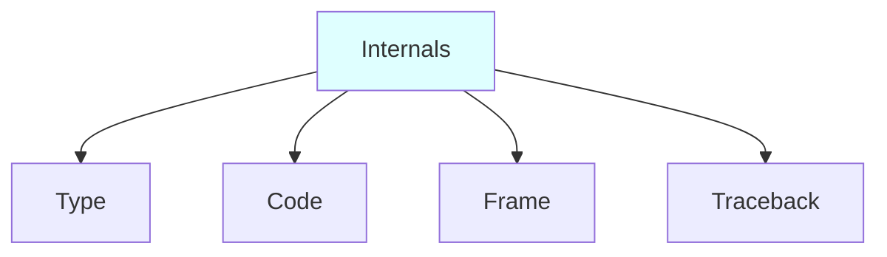

Excel读取模块 ：xlwt

编程，是用一些步骤（操作方式），去处理一些事情（操作的对象）。
程序处理的数据，以对象的形式出现。对象，是内存中的一部分，包含数值和相关的各种操作。
Python 程序由模块构成，模块包含语句，语句包含表达式，表达式建立并且处理对象——所以，对象是Python中最基本的概念。在Python程序中处理的每种东西，都是一种对象。
C／C++／Java，编程中很多工作都是作数据结构：定义数据类型，内存分配，对象搜索和存取等。而Python的内置数据类型非常强大。
为什么要优先使用内置数据类型？（而不是自己构建数据类型）
1. 写起来容易，效率高
2. 即使要构建自己的数据类型（比如写个class），在内置类型的基础上构建也会更简单

Python可以在旧版本中开启新版本的特性，只需： `from __future__ import name`

# 类型和运算
## 类型入门
Python 没有类型声明，表达式的语法就决定了创建和使用的对象的类型。每个数据类型，都和某些操作一一对应。
核心数据类型（对象的类型）：数字（包括集合）／字符串／元组／列表／字典／None／Boolean／函数／类／模块／文件



```mermaid
graph TB;%%这是注释
    A(Collections)-->B1(Sequences)
    B1-->C1(Immutable);%%这是注释
    C1-->String
    String-->Unicode/Py2
    String-->Bytes[BytesPy3]
    C1-->Tuple
    B1-->C2(Mutable)
    C2-->List
    C2-->ByteArray/Py3
    A-->B2(Mappings)
    B2-->Dictionary
    A-->B3(Sets)
    B3-->Set
    B3-->Frozenset
    classDef interface fill:#dFFFFf;
    style A fill:#dFFFFf;
    style B1 fill:#dFFFFf;style B2 fill:#dFFFFf;style B3 fill:#dFFFFf;
    style C1 fill:#dFFFFf;style C2 fill:#dFFFFf;
```



**空值None**：空值是Python里一个特殊的值，用None表示。None对象是一个特殊的Python对象，它总是False，一般用于占位。它有一块内存，是一个真正的对象。它不代表未定义，事实上它有定义。None是所有函数和方法的默认返回值。
None不是False：False和True对应，它作为布尔类型用来描述逻辑中“假”这个概念；None和“存在元素”相对应，“存在元素”反过来为“不存在元素”，也就是None。
None和java的null是不同的，null是空字符，而Python的None是NoneType类的一个实例。
```python
>>> type(None)
<class 'NoneType'>
```

**六个标准数据类型：**
- Number（数字）、String（字符串）、List（列表）、Tuple（元组）、Sets（集合）、Dictionary（字典）
- 可变数据类型：列表list[ ]、字典dict{ }
- 不可变数据类型：整型int、字符串str''、元组tuple（）

**如何查看一个类型的帮助文档？**
- ```python
s =‘astring’
dir(s)  # 列出所有的字符串的方法名
help(s.upper)  # 列出字符串特定属性upper的使用帮助
help(s)   # 列出所有字符串类型的帮助文档——不建议使用这种方式
```

**查看一个对象的类型**
在Python中，一切都是对象。每个基本的数据类型，都是一个预置的类。
而运算符，是类的方法，与普通的 X.method()没有什么不同，但是它又是特殊的方法。比如list的`__add__()`方法，定义了`+`这个符号对于列表实例对象的意义。类似地，自定义类的时候，也可以用运算符重载的技术做到这点。
- type(x)返回变量x指向对象的类型
```python
>>> type("")
<class 'str'>
```
- Python中，任何东西都是对象类型，类型本身也是对象类型：
```python
>>> type(list)
<class 'type'>
>>> type(type)
<class 'type'>
```
- isinstance(x, aClass)用于测试x所指对象是否是 aClass类的一个实例。这适用于内置数据类型（比如str），和自定义的class。
```python
>>> isinstance([], list)
True
```
- 调用一个类型的名字，是调用它的构造函数，而不仅仅是类型转换
```python
>>> str(True)
'True' # 布尔值转为str
```
- 有3种方式检查数据类型，并且进行限制：
```python
s = "string"
if type(s) == type(list):
    print("%s is a list" % s)
if type(s) == type([]):
    print("%s is a list" % s)
if type(s) is isinstance(s, list):  # 最好的方式
    print("%s is a list" % s)
```
但是，一般来说，在代码中进行类型检查是错误的，破坏了代码的灵活性，限制了代码的类型。Python代码不关心特定的数据类型，只关心接口，这就是Python的多态设计。
动态类型，不进行类型约束，这是Python多态的基础。Python的多态是属性总是在运行期解析，一个操作的意义取决于被操作对象的类型（比如x.attr表达式的意义取决于x的类型）。同样的操作对不同的对象来说意义可能不同，前提是该对象支持该操作；若对象不支持某种操作，则Python会在运行时检测到错误并自动抛出一个异常。

#####动态类型简介
Python 是动态类型语言。也是强类型语言，特定的对象有特定的接口，只能执行特定的操作。
动态类型和多态，是Python语言简洁和灵活的根源。
Python 只有一种赋值模型，所以理解了动态类型，就随处可用了。
**初始化赋值：变量、对象、引用**
初始化赋值语句`a = 3`
- **对象：**等式右边，常量 3 创建了一个新的对象（一块内存空间）去表示这个值。
○ 每次运行一个表达式（运算或者常量赋值）生成一个新的值，Python都创建一个新的对象（内存空间）去表示这个值。
○ Python对象缓存了不变的对象并对其进行复用，如小整数和小字符串。但是逻辑上看，每个表达式的结果值都是不同的对象，占用不同的内存。
○ 每个对象都有2个标准的头部信息：数据类型标识符、引用计数器。
○ 类型标志符：标识了该对象的类型。查看对象的类型用type()函数
○ 引用计数器：记录当前指向该对象的引用的数目，决定是否可以回收这个对象 。一旦它为0， 则该对象的内存空间就会自动回收。sys模块的getrefcount函数会返回对象的引用次数。
- **变量：**等式左边，创建一个变量名 a
○ 变量是一个系统表对象，拥有指向对象内存空间的连接（引用）。在Python内部，变量实际上是指向对象内存空间的一个指针
○ 变量在初始化赋值（第一次赋值）时创建。
○ 变量是通用的（一个变量可以引用任何对象），只是在某个特定的时间点引用了一个特定的对象。变量没有类型，不需要声明变量的类型。类型由对象决定，并且自动跟踪变量引用的对象的类型。
○ 当变量使用时（比如出现在表达式中），它会马上被当前引用的对象所代替，这时候解释器自动探测出对象的类型。比如  c = a ，将 a 引用的   对象 3  再次引用给 c 。未初始化赋值、创建的变量不准使用。
○ 给一个变量赋新值，并不是替换原始的对象，而是让这个变量去引用完全不同的一个对象。所以，仅仅会影响变量，不会影响对象。在有些语言中，变量是可改变的内存区域的地址，重新赋值会替换这个内存区域的值。而在Python中，变量是一个指向内存区域的指针，重新赋值，是让这个变量去引用一个新的对象（指向新的内存空间）。
- **引用：**赋值语句的等式，创建一个变量 a 与对象 3 的引用。变量和对象存储在内存的不同区域，并通过引用相连。
○ 引用就是从变量到对象的内存指针，相当于 C 语言的 void 指针。
○ 查询一个对象被引用的次数：数字对象 1 被引用了 607 次
```python
>>> import sys
>>> sys.getrefcount(1)
607
```

**共享引用**
多个变量名引用同一个对象时，称为共享引用
- ```python
a = 3    # 初始化赋值，创建对象 3、变量 a 、以及相互之间的引用。
b = a    # 变量a马上被替换成对象 3，所以b也引用了对象 3——a与b共同引用一块内存区域
a = a + 2   # 变量a 替换成对象 3 ，与对象 2 进行运算得到全新的对象 5，然后创建变量a 与对象 5的引用。此语句对 变量 b 没有任何影响。
a = "something"  # 变量a 引用新的对象 "something"
```
- **判断是否共享引用（同一个还是相等）**
==操作符比较的是两个变量引用的对象是否具有相同的值
is操作符比较的是两个变量是否引用的是同一个对象。共享引用的多个变量之间，is比较的结果为True。
```python
L = [1, 2, 3]
M = [1, 2, 3]
print L == M  # True ，因为 == 操作符比较两个对象的数值，数值的确相等。
print L is M  # False ，因为 is 操作符比较L与M是不是引用同一个对象（指向同一块内存）
```
但是，有时候又会出现“意外情况”：
```python
L = 42
M = 42
print L == M  # True ，因为 == 操作符比较两个对象的数值，数值的确相等。
print L is M  # True ，很奇怪。
```
因为Python把小的整数缓存，并且复用了，所以L与M的确引用了同一个对象。这是Python决定的，不是代码能够改变的。
- **共享引用的原地修改**
在共享引用中，对象的原地修改操作会影响到所有的引用该对象的变量。有些数据类型的对象，本身就是对其他对象的引用，所以是可变的，可以原地修改。比如列表、字典、class
```python
L1 = [1, 2, 3, 4]
L2 = L1  # 共享引用。L2 也引用了list 对象 [1, 2, 3, 4]
L1 = 89  # L1 引用了全新的对象 89。不影响 L2
```
但是，下面就会相互影响了
```python
L1 = [1, 2, 3, 4]
L2 = L1  # L1与L2共享引用
L1[0] = 32  # 结果L2 也受到了影响，变为 [32, 2, 3, 4]
```
避免共享对象带来的影响，可以直接拷贝对象。让不同的变量，引用不同的对象（指向不同的内存区域）
```python
L2 = L1[:]  # 列表拷贝最简单的办法——从头到尾切片。
其他的对象，应该使用copy方法
import copy
x = copy.copy(y)  # make a shallow copy of y 创建对象 y 的影子拷贝
x = copy.deepcopy(y)  # make a deep copy of y 创建对象 y 的深度拷贝
```
影子拷贝和深度拷贝，差异就在复合对象上（包含其他对象的对象，比如列表和实例）。
影子拷贝是创建一个复合对象，然后内含的对象，还是上一个对象的引用。
深度拷贝，创建一个复合对象，内含的对象，也是新建的。


```python


```


#####字符串

序列：包含其他对象的有序集合

s = ‘spam’

索引
print s[0] # 正向索引index，从左至右
print s[-1] # 反向索引，从右至左，相当于 s[len(s)-1]
切片
s[ M : N ]   切片，在序列 s 中，取出偏移量为M，直到但不包括偏移量为 N 的内容，最后得到一个新对象。
常见切片
s[1:]    # 去除首位
s[:-1]   # 去除末位
s[:]    # 完整复制
注意，序列绝对不能越界访问。
len(s) #计算出长度


某类序列特定的操作
astring.upper()   # 通用操作与特有操作是不同的

不可变性：字符串／元组／数字创建后就不可变，而列表和字典可变。
s = ‘something’
s = ‘do ’ + s   # 变量 s 的确变为 ‘do something’, 但这是形成新的字符串对象，引用赋予变量s
字符串
字符串是由很多’单字符串’构成的序列。Python没有 Char类型，每个字母都是字符串。
字符串支持通用的序列操作。
字符串拼接：见官方 Doc
字符串特有的函数：find  replace lower upper split join strip
字符串格式化：% 与 format
模式匹配 re 模块：搜索／分割／替换，但因为它支持模式定义，所以更通用。
序列是其他对象的有序集合，通过位置索引。字典是其他对象的无序集合，通过键索引。

#####列表

最通用的序列。

列表是一个任意类型的对象的位置相关的有序集合。大小可变。

L.append(’s’)  # 在末尾添加一个对象

L.pop(2)  # 指定删除一个索引值的对象

del L[2]  # 指定删除一个索引值的对象

insert／remove

L.sort()  # 按照 ASCII 生序排列

L.reverse()  # 将原来的顺序 ，反向排列

列表可以嵌套，最常用的是组建多维数组（最常见的是矩阵）和 json 这样的复杂数据。

列表解析式

使用多维数组时，列表解析非常实用。

M = [ [1,2,3],

         [4,5,6],

         [7,8,9] ]

1.简单解析。col2 = [ row[1] for row in M ]  # [2,5,8]

    列表解析式 由 表达式 row[1] 和表达式 for row in M 组成，前面的表达式负责取值和运算，后面的表达式是循环迭代结构，注意两个表达式 有个变量名 row是相关联的。解析式被[ ] 包围，这说明结果是一个列表。

   本质是一个 for 循环

col2 = []

for row in M:

     col2.append(row[1])

2. 解析后运算  new_col2 = [ row[1] + 10 for row in M ]  # [12, 15, 18]

3. 解析后过滤  new_col2x = [ row[1] for row in M if row[1] < 7]  # [2, 5]

4. 多个列表交互解析 collect a diagonal from matrix

    diag = [ M[i][i] for i in [0,1,2] ] # 结果 [1，5，9]，也可以写成 for i in range(3)

5. 创建集合和字典

   col2_set = {row[1] for row in M }  # 结果{2,5,8}

   col2_dic = {i:row[1] for i in range(1,4)}  # 结果{1:2, 2:5, 3:8}

6. 解析式创建生成器

Gener = (sum(row) for row in M)

next(Gener) # 结果为6

P63-P70，模块

序列：Str/List/Tuple

映射：dict

 

#####字典

字典是一种映射，也是Python中唯一的映射。映射是一个其他对象的集合，通过键值对来存储对象。大小可变。

d = {}  # 创建空字典

d = {‘food’：‘spam’，‘weight’：4，‘color‘：’red‘}  # 用键值对创建一个字典

d[’food‘]  # 用键读取值

d[’weight‘] += 1  # 重新赋值，就是改变key对应的value

d[‘name’] = ‘apple’  # 增加一个键值对。可以创建{}，然后不断增加键值对

 

字典和列表一起，可以轻松地组建 json那样的复杂／高级数据结构。C／C++需要先设计／声明结构和数组，填写值，然后拼接，非常麻烦。

字典可以迭代遍历key：  for key in d：print d[key]

有时候需要按照一定的顺序遍历：

方法1

	keylist = list（d.keys() ）   # 提取所有的key，组建一个list

	for key in keylist.sort():     # list排序，然后遍历

		print d[key]            # 用key 提取 value

方法 2  for key in sorted(d): print d[key]    # 一步完成，效果一样

字典取值，也要特别注意『越界』问题——如果key不存在，会引发异常。避免的手段：

	value = d.get(‘x’,0)   # 如果’x’键不存在，就使用默认值 0

	value = d[‘x’] if ‘x’in d else 0 # 具有相同的效果

	还可以用has_key方法、try语句

 

 

for循环是迭代操作。for循环、列表解析（本质也是for循环），是通用的迭代工具，遵循迭代协议。迭代协议：一个内存中的序列、或一个迭代操作中，每次都产生一个元素。

列表解析、map、filter 比 for循环快很多，但Python 程序优先考虑简单和可读性，其次再考虑优化和性能，所以最广泛的还是for循环。

 

 

#####元组 tuple

元组，任意类型、任意嵌套。不可变的序列，与列表很相似。

除了序列的共有方法，list的列表修改是无法应用于tuple 的，但是tuple又有自己独特的方法

	t =  (‘a’,’b’,’c’,’d’)

	m = t.index(‘c’)  # 得出一个元素的索引值。结果为2

	n = t.count(‘c’)  # 得出一个元素出现的次数。结果为1

 

#####文件 file

文件对象不是通过常量语法（比如 l = [1,2,3] ）创建的，而是调用 open() 函数创建的。

```python

写入操作

    f = open('data.txt','w')  # (文件名，处理模式)

    f.write('Hello\n')  # 写入一行字符

    f.close()  # 关闭文件

读取操作

    f = open('data.txt')  # 处理模式默认值为 'r'

    text = f.read()  # 读取文件内所有的内容（或者读取指定的字节数），存入变量

    print(text)  # 将内容打印

    f.close()  # 关闭文件

    text.split()  # 内容可以继续进行处理

    readline() 每次读取一行。seek() 移动到一个新的文件位置。

    文件读取的最好的方式，是使用迭代器 iterator

在Python3 中，文本与二进制的文件对象是截然不同的。

    f = open('data.txt')  # 文本文件，内容解析成字符串，默认执行Unicode编码

    f = open('data.bin','rb')  # 二进制文件，解析二进制

```

还有其他文件类工具：管道、先进先出队列FIFO、套接字Socket、数据库接口对象、通过键访问文件、对象持久化、基于描述符的文件


其他核心类型：集合set、固定精度浮点数、分数Fraction、布尔值bool、占位符None


## 数字


**  乘方


数字类型，是一组类似数据类型的归类。包括：整数int、浮点数float、复数complex、固定精度浮点数Decimal、分数Fraction、集合Set、布尔型bool。

本章还包括：官方自带的数学函数、模块

整数int

整数包括正负，并且有无穷的精度（不管多大都不会超出内存限额）。

在Python2.x中，如果一个整数超过内存限制，会自动转成 long int，数字后面加个L。但是Python3.x中，只有int，无穷精度。

数字常量表示方式：二进制八进制十进制十六进制 p134、p118

浮点数 float

`1.0   2.3   3.14e-10`

算术中，只要出现浮点数float，就自动将相关的数据转成浮点数的精度和运算法则（相当于C语言的double）

```python

a = 1.0 + 5  #  6.0

b = 1 + 5   #  6

```

hex()、oct()、bin() 把一个十进制数值转成相应进制的字符串，而 int(str, base)则把字符串按指定的进制，转成十进制整数。

 

 

小数、十进制数（固定精度浮点数）Decimal

Decimal提供了固定小数位的浮点数（所谓固定精度），还可以定义舍入的方式（比如四舍五入）。

两种方式创建：整数int，字符串str

```python

    import decimal

	a = decimal.Decimal(1)/decimal.Decimal(10)

    from decimal import Decimal

    a = Decimal('0.1')

```

创建时可以设置小数运算的精度

```python

    import decimal

    a = decimal.Decimal(1) / decimal.Decimal(7)  

    print(a) #不设精度，无限循环小数0.1428571428571428571428571429

    decimal.getcontext().prec = 2  # 设定精度

    b = decimal.Decimal(1) / decimal.Decimal(7) 

	print(b)  # 0.14 固定位数小数

```


还可以用with 环境管理器设置精度

```python

	import decimal

	    with decimal.localcontext() as context:

	        context.prec = 2

	        b = decimal.Decimal(1) / decimal.Decimal(7)

	    print(b)   # 0.14

	    a = decimal.Decimal(1) / decimal.Decimal(7)

	    print(a) #离开with，精度还原 0.1428571428571428571428571429

```

分数 Fraction

```python

	from  fractions import Fraction

	x = Fraction(1,3)  # 2个整数，创建分数

	y = Fraction(4,6)

	m = Fraction('1.25')  # 用一个字符串、里面是浮点数，创建分数 5/4

```


接下来，可以像普通的数字一样使用分数 x+y, x-y, x/y, x*y, x**y

分数与小数，二者是近亲。浮点数因为内存空间有限，所以精度有限，而分数和小数能提供更准确、更直观的结果。

更准确：

```python

    from decimal import Decimal; from fractions import Fraction

    a_float = 0.1 + 0.1 + 0.1 - 0.3  # 本应为 0，却不为0，因为float的精度不够

    a_decimal = Decimal('0.1')+Decimal('0.1')+Decimal('0.1')-Decimal('0.3')  # 结果 0.0

	a_fraction = Fraction(1, 10) + Fraction(1, 10) + Fraction(1, 10) - Fraction(3, 10)  # 结果 0

```

更直观：分数，是小学生的知识，简单易懂；而固定位数的小数 0.33，也比 杂乱的浮点数 0.33333333 更易读

```python

import decimal

    from fractions import Fraction

    with decimal.localcontext() as context:

        context.prec = 2

        a_float = 1/3 # 0.3333333333333333

        a_decimal = decimal.Decimal(1)/decimal.Decimal(3)  # 0.33

        a_fraction = Fraction(1, 3) # 1/3

```

 

集合 set

一些唯一的、不可变的对象的一个无序集合/Collection。支持一般的数学集合操作。广泛应用于数学和数据库工作中。

集合set既不是序列，也不是映射。集合很像一个只有key没有value的字典：可迭代、可增减、能包含各种类型的对象。

支持len()，可迭代。但不能序列操作——索引和切片。

```python

x = set('abcde')  # 传入一个可迭代对象，构造函数自动创建一个set，结果{'a','b','c','d','e'}

a_dict = {'d': 1, 'e': 2, 'x': 3, 'y': 2, 'z': 3}

y = set(a_dict)  # 字典的key构建了set ，结果{'e', 'd', 'x', 'y', 'z'}

print('e' in x)  # 布尔运算：成员测试，'e'是集合x的成员吗？

print(x|y)  # 数学求并集 {'a', 'b', 'c', 'd', 'e', 'x', 'y', 'z'}

print(x&y)  # 交集 {'d', 'e'}

print(sorted(x^y))  # 并集，然后减去交集。也就是 两个集合不重合的部分 {'a', 'b', 'c', 'x', 'y', 'z'}

print(x>y)  # 布尔运算，子集测试，y是x的子集吗？

```

P146集合操作的各种方法

创建空集合  s1 = set()   # dict = {} 这是创建空字典

如果一个对象是可变的（比如列表list），那么它不可散列Unhashable，就不能作为集合set的元素，也不能作为字典dict的键。


布尔值 bool 

进行逻辑判断（比如if）时，布尔运算规则。

- 基本类型（每个类型都存在一个值会被判定为False）：

    - 布尔型，False表示False，其他为True

    - 整数和浮点数，0表示False，其他为True

    - 字符串和类字符串类型（包括bytes和unicode），空字符串表示False，其他为True

    - 序列类型（包括tuple，list，dict，set等），空表示False，非空表示True

    - None永远表示False

- 自定义类型：

    - 如果定义了__nonzero__()方法，会调用这个方法，并按照返回值判断这个对象等价于True还是False

    - 如果没有定义__nonzero__方法但定义了__len__方法，会调用__len__方法，当返回0时为False，否则为True（这样就跟内置类型为空时对应False相同了）

    - 如果都没有定义，所有的对象都是True，只有None对应False


P152

连续布尔值运算：

    x,y,z = 2,4,6

    if x<y<z: pass  # 相当于 x<y and y<z 

    if x<y>z:pass  # 相当于 x<y and y>z

    if x==y<z:pass  # 相当于 x==y and y<z

 

占位符 None

 

 

二进制，位操作 p136

移位

或运算

与运算

 

类型转换

	`向上转型，自动转换：int<float<complex`

不可以在数字类型和其他类型之间使用自动转换，比如 a = ‘some’+ 10

	`向下转型，强制转换，将会截尾：int(3.1415) 为 3`

运算符重载

某些操作符能够根据所处理的内置对象的类型，而执行不同的操作。比如

```python

a = 10 + 5  # 数字型，执行加法

a = ‘some’+ ‘body’ # 对于 str 或者 list，执行合并

```

显示格式

```python

    num = 1/3

    r_num = repr(num)  # 源数据显示模式，可以显示额外的细节

	str_num = str(num)  # 用户友好显示模式

	# 两个函数都可以把任意对象转换成字符串，但是效果不太相同。

    print(r_num,'\n',str_num)

```


内置的数学函数和模块，有很多的数学特有操作：

- 内置数学函数：pow、abs、round、int、hex、bin

- 内置数学模块：random、math

```python

    pow(2, 4)  # 等价于 2**4 = 16

    abs(-42)  # 绝对值运算，|-42| = 42

    sum([1, 2, 3, 4])  # 求和运算 1+2+3+4 = 10

    min([1, 2, 3, 4])  # 求最小值，结果为1。max()求最大值

    import math

    p = math.pi  # 3.141592653589793

    s = math.sqrt(144)  # 求平方根方式 1 ，结果为 12.0

    s = 144 ** 0.5  # 求平方根方式 2

	s = pow(144, 0.5)  # 求平方根方式 3

    import random

    random.random()  # 产生一个随机的浮点数，比如 0.9139864997839369

    random.randint(1, 10)  # 产生一个1-10之间的随机整数

    random.choice(['a', 'b', 'c'])  # 随机选择

```

其他扩展：

Numpy（Numeric Python）是第三方模块，被称为 免费易用的Matlab。支持矩阵、向量、高级计算。

Scipy

p120 Python 表达式操作符


除法的规则

```python

print(10/5)   # 结果为  2.0  除法永远返回 float

print(7//3)   # 2   整除（地板除 floor division）

print(7//-3)  # -3

% 取模运算

如果整数int 与 浮点数float 混合运算，整数就会自动转化为float

a = 17/3   # 5 地板除。两个int相除，返回int。

b = 17/3.0  # 5.66... 真除法。一旦出现float，就int转成float，整个运算执行float法则

c = 17//3.0  # 5.0  强制地板除。即使出现浮点数，按照float法则运算，但强制截尾

```

可变的对象，比如 list

- 使用多重目标赋值、增强赋值语句，要小心，远处的修改会影响其他变量。

    ```python

    a = b = [1, 2, 3]

    c = ['c']

    c += a  # ['c', 1, 2, 3]

    print(a, b, c)  # [1, 2, 3] [1, 2, 3] ['c', 1, 2, 3]

    a += a

    print(a, b)  # 都为 [1, 2, 3, 1, 2, 3]

    ```

- 原处修改对象的函数没有返回值

    ```python

    L = [1,2,3,4]

    L.append(8)  # 返回None，也就是没有返回值。

    L = L.append(8)  # 他本来想得到修改后的列表，然而却只能得到 L = None

	for k in D.keys().sort():  # 这写法也是错误的。因为 D.keys().sort()返回None

    # 正确写法：

    ks = list(D.keys()); ks.sort()

    for k in ks:

    ```


## 字符串

字符串是一个有序的字符的集合。Python没有C-like的char单字符类型，字符串的基本组成是单字符串。

#####字符串的创建（常量表达）

- ```python

s = "" # 空字符串。

# 单引号和双引号的意义是一样的

a = 'spam eggs';  b = "spam eggs"

# 字符串常量跨行（不是多行字符串，只是替代换行符而已）

a = ('aaa'

'bbb'

'ccc')

# 引号里面有引号

a = 'doesn\'t'  # doesn't 用 \'将单引号转义

a = "\"Yes,\" he said."

a = "doesn't"  # 或者混用单双引号

a = '"Yes," he said.'

# 反斜杠\加上一些符号，代表特殊的字节编码——转义序列

s = 'First line.\nSecond line.'  # 换行符

# r避免转义——row字符串

s = r'C:\some\name'

# 多行字符串，三重引号（三重引号也会用作文档字符串、块注释）

string = '''how

are

you'''

string = 'how \n are \n you' # 多行字符串的等效形式

```


#####序列通用操作


- ```python

重复和拼接

s = 3 * 'un' + 'ium'

索引和分片

序列索引的原理，以"python"为例

 +---+---+---+---+---+---+

 | P | y | t | h | o | n |

 +---+---+---+---+---+---+

 0   1   2   3   4   5   6

-6  -5  -4  -3  -2  -1

```


## 列表与元组


## 字典


